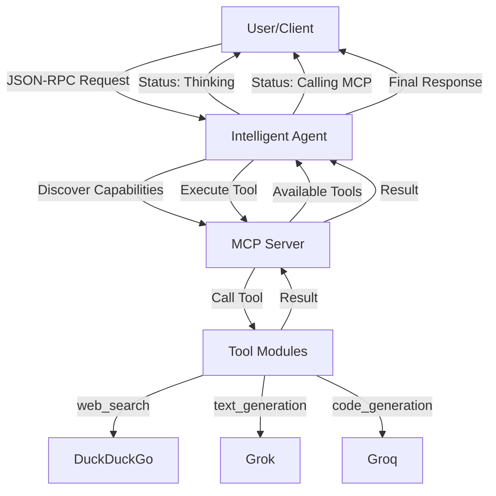

# Intelligent Agent Implementation Plan

## Goal
Implement an intelligent agent that uses JSON-RPC for communication, dynamically discovers MCP tools, intelligently routes requests, and provides real-time status updates during execution.

## Architecture Overview



## Proposed Changes

### Agent Core
#### [MODIFY] [core.py](file:///e:/Projects/Agent/agent/core.py)

**Current Issues:**
- No capability awareness
- No status callbacks
- Not dynamically tracking available tools

**Changes:**
1. Add `status_callback` parameter to show real-time updates
2. Implement dynamic tool discovery from MCP server
3. Add capability awareness (track available tools)
4. Enhance intelligent tool selection with better scoring
5. Add status updates: "Thinking...", "Calling MCP...", "Processing results..."

**New Methods:**
- `get_capabilities()` - Query MCP for available tools
- `_emit_status(status: str)` - Send status updates
- Enhanced [_select_tool()](file:///e:/Projects/Agent/agent/core.py#47-67) with confidence scoring

---

### MCP Client
#### [MODIFY] [client.py](file:///e:/Projects/Agent/mcp/client.py)

**Changes:**
1. Add method to list available tools from MCP server
2. Add status callback support
3. Improve error handling with detailed messages

**New Methods:**
- `list_tools()` - Get list of available tools from MCP
- `get_tool_info(tool_name: str)` - Get tool capabilities

---

### MCP Server
#### [MODIFY] [server.py](file:///e:/Projects/Agent/mcp/server.py)

**Changes:**
1. Add method to list registered tools
2. Add tool metadata (description, parameters)
3. Support tool hot-reload (dynamic add/remove)

**New Methods:**
- `list_tools()` - Return list of available tools with metadata
- `reload_tools()` - Rediscover tools from directory

---

### Tool Modules
#### [MODIFY] [tools/__init__.py](file:///e:/Projects/Agent/mcp/tools/__init__.py)

**Changes:**
1. Add tool metadata extraction (name, description, parameters)
2. Improve error handling for failed tool loads

**Each tool file should export:**
```python
TOOL_NAME = "tool_name"
TOOL_DESCRIPTION = "What this tool does"
TOOL_PARAMETERS = {"param1": "description"}

def execute(**kwargs):
    # Tool logic
    pass
```

#### [MODIFY] Tool files: [text_generation.py](file:///e:/Projects/Agent/mcp/tools/text_generation.py), [code_generation.py](file:///e:/Projects/Agent/mcp/tools/code_generation.py), [web_search.py](file:///e:/Projects/Agent/mcp/tools/web_search.py)

Add metadata to each tool:
- `TOOL_DESCRIPTION`
- `TOOL_PARAMETERS`

---

### Application Entry Point
#### [MODIFY] [app.py](file:///e:/Projects/Agent/app.py)

**Changes:**
1. Add WebSocket support for real-time status updates (optional)
2. Improve initialization logging
3. Add endpoint to list available tools

**New Endpoints:**
- `GET /tools` - List all available tools
- `POST /tools/reload` - Reload tools dynamically

---

### Configuration
#### [MODIFY] [config.py](file:///e:/Projects/Agent/config.py)

**Changes:**
1. Add configuration for status updates
2. Add tool discovery settings

## Verification Plan

### Automated Tests
1. **Test tool discovery:**
   ```python
   python -c "from mcp.server import MCPServer; s = MCPServer(); print(s.list_tools())"
   ```

2. **Test agent capabilities:**
   ```python
   # Create test script to verify agent can list its capabilities
   ```

3. **Test status callbacks:**
   ```python
   # Verify status updates are emitted during execution
   ```

### Manual Verification
1. Start the application: `python app.py`
2. Send a web search request and verify status updates
3. Add a new tool to `mcp/tools/` and verify it's auto-discovered
4. Remove a tool and verify agent updates its capabilities

### Example Request Flow

**Request:**
```json
{
  "jsonrpc": "2.0",
  "method": "agent.chat",
  "params": {"message": "What's the latest stock price for Tesla?"},
  "id": 1
}
```

**Expected Status Updates:**
1. `"status": "Thinking... analyzing request"`
2. `"status": "Selected tool: web_search (confidence: 95%)"`
3. `"status": "Calling MCP server..."`
4. `"status": "Tool web_search executing..."`
5. `"status": "Processing results..."`
6. `"result": "...structured answer..."`
